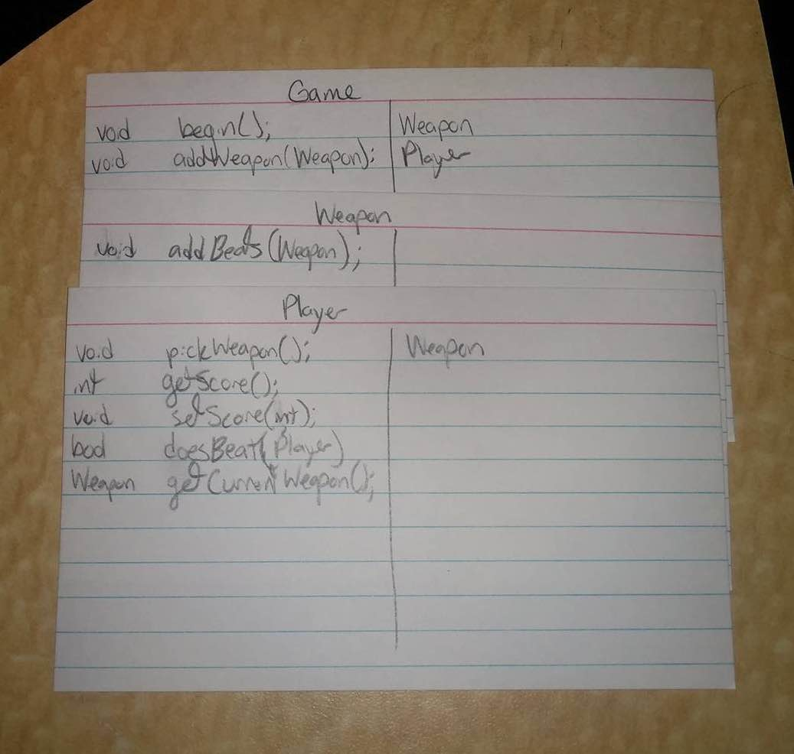

CompSci 308 : RPS Design
===================

> This is the link to the Lab Description: 
[Lab - RPS](http://www.cs.duke.edu/courses/compsci308/spring16/classwork/02_design_rps/index.php)

#Design
####By Blake Kaplan (bjk20), Patrick Grady (plg5), Bobby Wang (bcw22), and Justin Bergkamp (jtb43)

###Class: Weapon

* A class that can be instantiated for any weapon based on what is fed into the constructor

Methods:
```java
//Used for updating the inter-weapon game dynamics
public void addBeats(Weapon beatWeapon)

//Determines the result when two weapons are played against each other
public boolean doesBeat(Weapon otherWeapon)
```
Instance Variables:
`List<Weapon> beats`


###Class: Player

* Represents each game player
* Will be able to determine which weapon it would like to throw

Methods:
```java
//Generates a Weapon that the user throws
public Weapon pickWeapon()

//Gets the players current score
public int getScore()

//Returns a boolean expressing whether or not the player beats the given other player
public boolean doesBeat(Player otherPlayer)

//Returns the player's current played weapon
public Weapon getCurrentWeapon()

//Changes the player's score
public void setScore(int score)
```
Instance Variables:
`Weapon currentWeapon`
`int myScore`
`List<Weapon> priorThrows`

###Class: Game
* The central game class
* Will have to have an initialization method(s) where it properly configures which weapons beat which other weapons

Methods:
```java
//Starts the game and generates the GUI
public void start()

//Adds a new weapon to the game
public void addWeapon(Weapon newWeapon)
```

Instance Variables:
`int roundsElapsed`
`List<Player> players`
`List<Weapon> weapons`

#Use Cases

A new game is started with two players, their scores are reset to 0.

`Game.begin();`

A player chooses his RPS "weapon" with which he wants to play for this round.

`Player.pickWeapon();`

Given two players' choices, one player wins the round, and their scores are updated.

`Player.doesBeat(Player otherPlayer);`

A new choice is added to an existing game and its relationship to all the other choices is updated.

`Game.addWeapon(Weapon newWeapon);`

A new game is added to the system, with its own relationships for its all its "weapons".

`Game.begin();`

#CRC Cards

