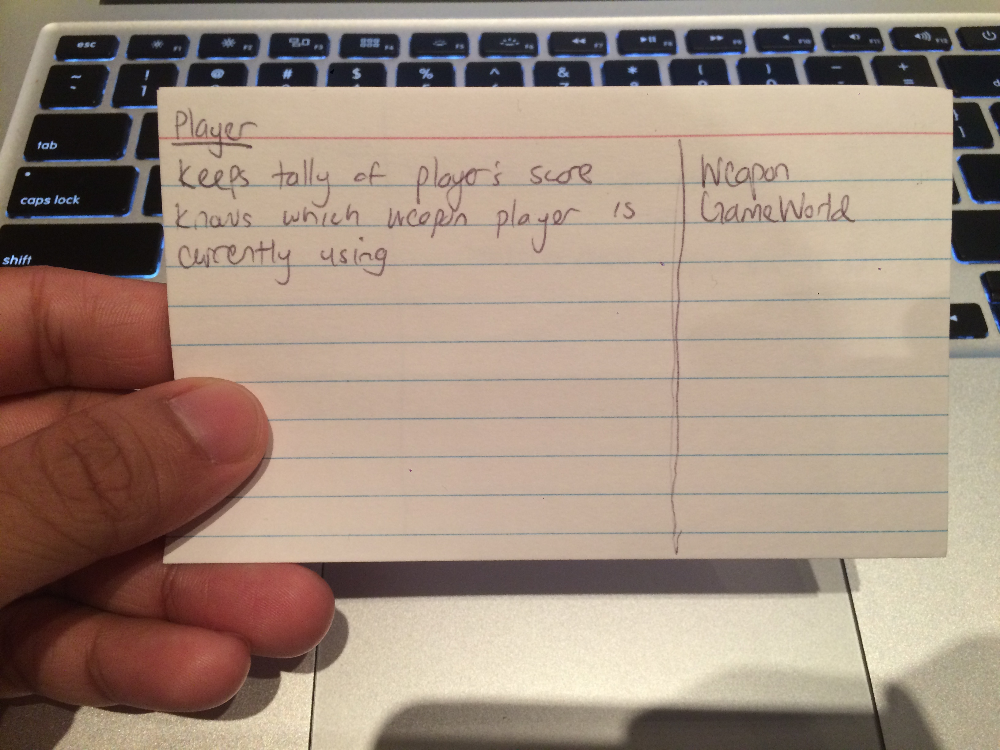
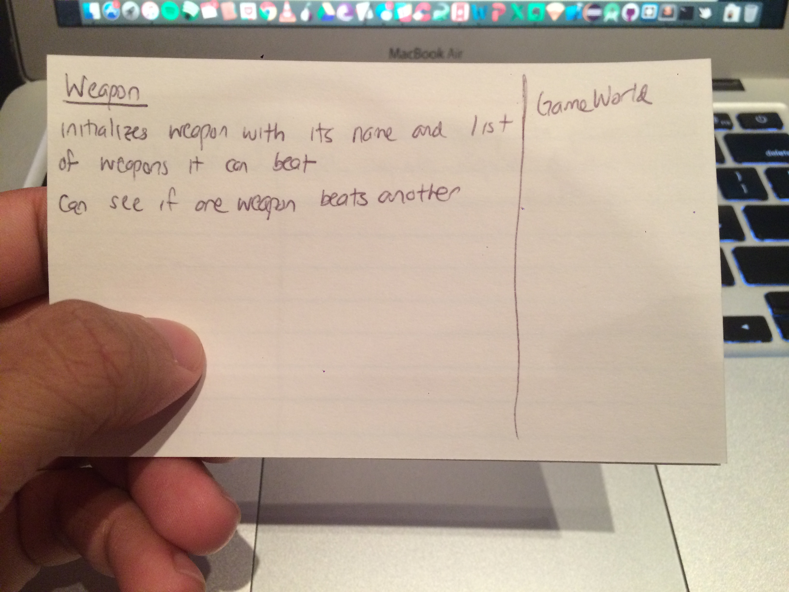
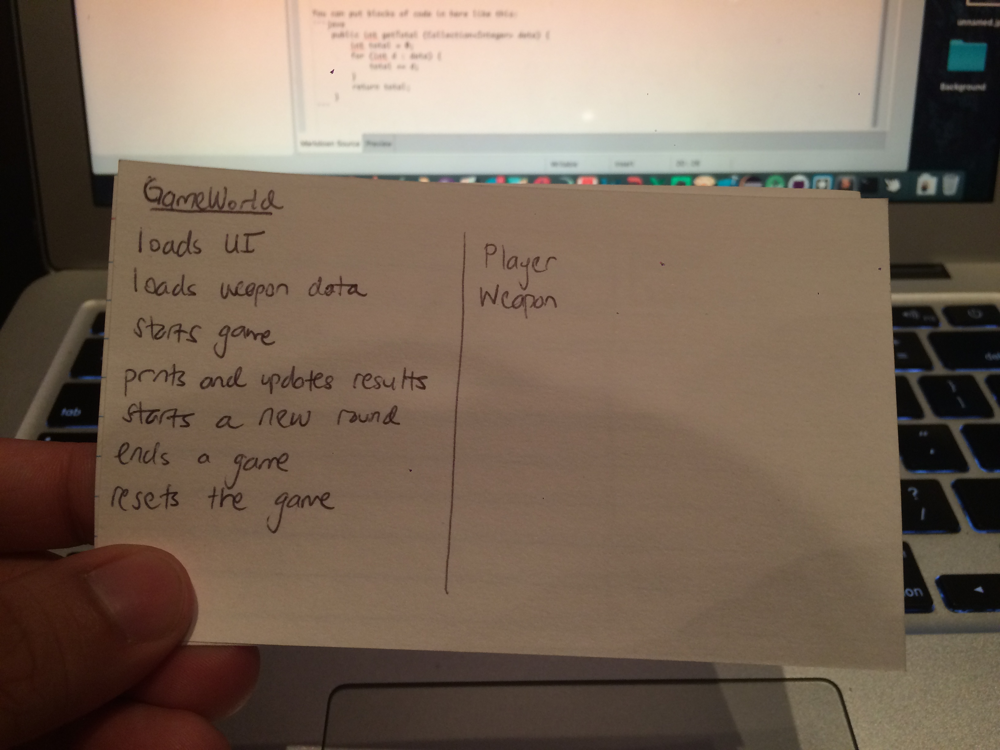

CompSci 308 : RPS Design
===================

> This is the link to the Lab Description: 
[Lab - RPS](http://www.cs.duke.edu/courses/compsci308/spring16/classwork/02_design_rps/index.php)

Initial Design
=======

###GameWorld
'''java
	private void loadUI()
	private void startGame()
 	private Map<Weapon, Collection<Weapon>> loadWeaponsData(File weaponData)
 	private void printAndUpdateResults(Player player1, Player player2) 
 	private void newRound()
	private void endGame()
	private void reset()
	private Weapon chooseWeapon()
	private void showWinner(Player player1, Player player2);
'''
* loadUI() is responsible for generating the user interface for the game.
* loadWeaponsData(File weaponData) is responsible for reading a file of weapons and creating a map with relationships between weapons in the form of a Map.
* startGame() is responsible for instantiating Players (setting their scores and other stats to zero).
* printAndUpdateResults(Player player1, Player player2) is responsible for displaying the results between two players and updating their scores.
* newRound() clears the weapon choices of players.
* endGame() stops the UI running.
* reset() reinitializes scores and weapon choices for players (restarts the game without closing the UI).


###Weapon
'''java
	public Weapon(String name, Collection<Weapon> listOfCanBeat)
	public int compareTo(Weapon other)
'''
* Weapon(String name, Collection<String> listOfCanBeat) is a constructor that initializes a weapon with a name and the list of other weapons it can beat.
* compareTo(String other) determines whether two weapons are the same or who beats who.

###Player
'''java
	public Player(int score)
	public Weapon getWeapon();
	public void addScore(int score);
'''
* Player(int score) is a constructor initializes with a score


CRC Design
=======





Use Cases
=======

You can put blocks of code in here like this:
```java
    public int getTotal (Collection<Integer> data) {
        Player p1 = new Player(0);
        Player p2 = new Player(0);
        startRound();
        int win = p1.getWeapon().compareTo(p2.getWeapon());
        if (win == 1) {
        	p1.addScore(1);
        } else if (win == -1){
        	p2.addScore(1);
        }      
        showWinner(p1, p2);
    }
```

''

