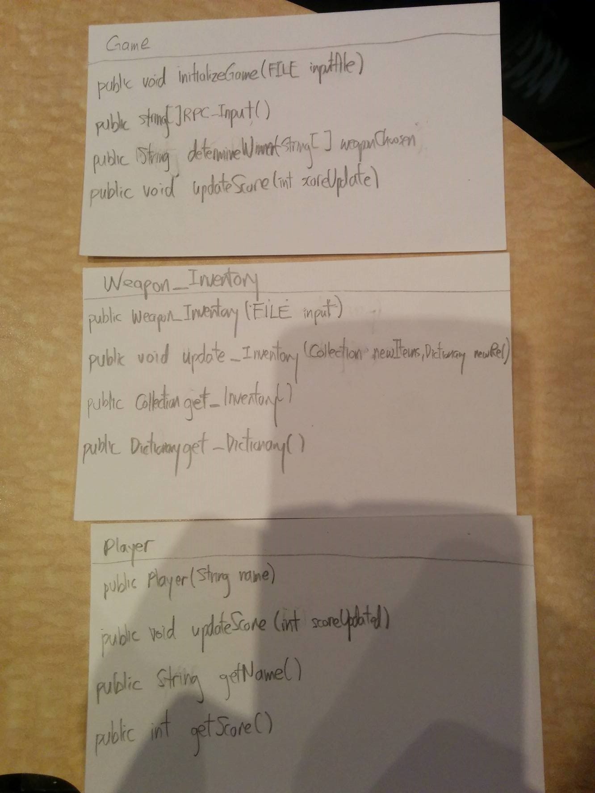

This is a RPC group design for NETID: "sa190", "rl144", "hl130"

CompSci 308 : RPS Design
===================

> This is the link to the Lab Description: 
[Lab - RPS](http://www.cs.duke.edu/courses/compsci308/spring16/classwork/02_design_rps/index.php)

Initial Design
=======

###public class Main //Main/Game Class that starts the program
* main method
1. Initialize two players from Class Player
2. first_chooseWeapon()
3. Start a loop
4. RPC_Input()
5. Input Handler()
6. RPC_Process()
6. Update Score()
7. End Loop
8. Print status after the game is over

* public void first_chooseWeapon() // Let user choose weapon_inventory
1. Input handler
2. Weapon_Inventory inv = new Weapon_Inventory(List of inputs) //initialize weapon_inventory 
* public void RPC_Input() 
1. Show options to user waiting for input
2. Take Input (Mouseclick) from Users (One player at a time)
3. Input Handler()
* RPC Process(input1, input2)
1. get_Dictionary
2. Look up from dictionary for result
3. Return RPC result;
* Update Score (RPC result)
1. player1.update(result)
2. player2.update(result)

### public class Player
* public Player // Constructor that initializes the player object
1. Player_Name
2. Score

* public void update(result of game)
1. if(win) score++;
2. else score--;  

### public class Weapon_Inventory
* public Weapon_Inventory(collection, dictionary) // Constructor
1. Collection (eg. List, Set) of inventories
2. Dictionary (eg. Map) of win/loss relationship 

* public void Add_Inventory(new items added, new relationships)
1. add new items to the collection
2. add new entries to the dictionary

* public void Get_Inventory()
1. Return the collection

* public void Get_Dictionary()
1. Return the dictionary

CRC Design
=======

###Class 1


###Class 2

You can add images as well:




Use Cases
=======

You can put blocks of code in here like this:
```java
    public int getTotal (Collection<Integer> data) {
        int total = 0;
        for (int d : data) {
            total += d;
        }
        return total;
    }
```

